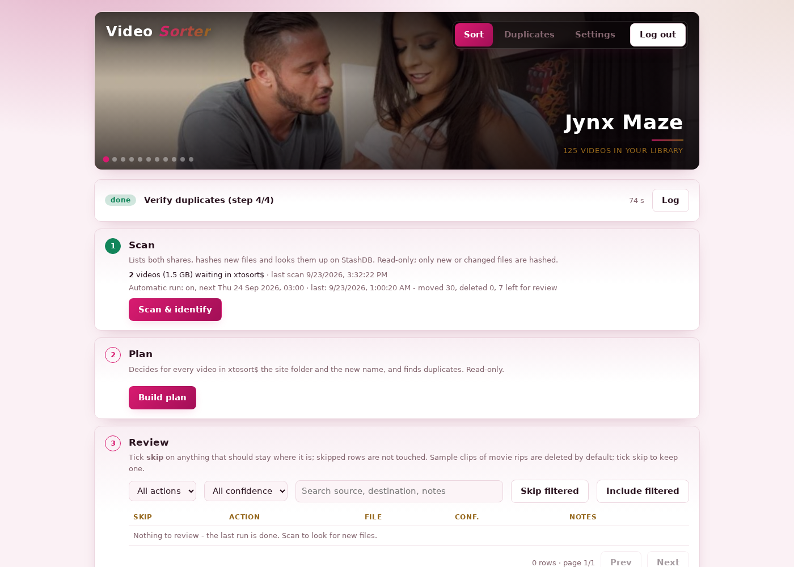
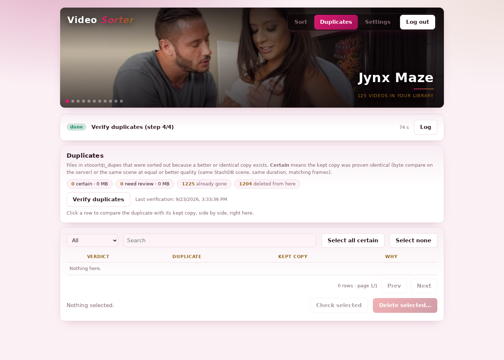
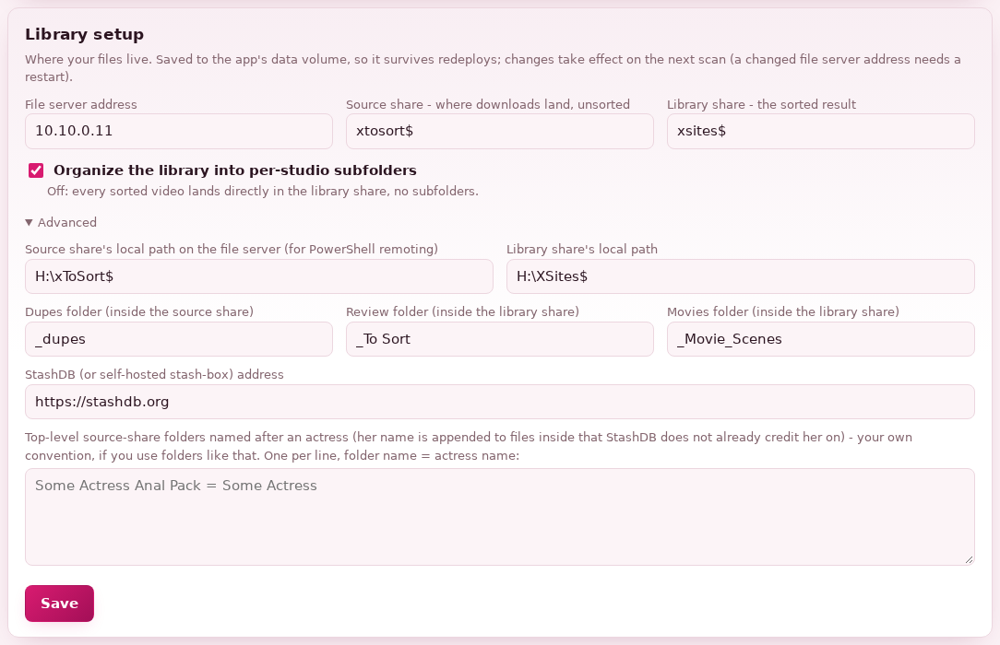

# Video Sorter

A self-hosted web app that sorts a folder of downloaded videos into a tidy library, using
[StashDB](https://stashdb.org) to identify each file by content (not filename) and the same
identification to catch duplicates - including copies with a different name, resolution or
container format. Built for a personal library sitting on a Windows file share.

It does three things:

- **Sort** - scans your "downloads" share, identifies every video against StashDB (by content
  fingerprint first, filename patterns as a fallback), and proposes a destination folder and a
  clean, standardized file name. You review the plan (skip anything you don't want touched), then
  execute it. Moves happen on the file server itself (PowerShell remoting), so they're instant
  same-volume renames, never a slow client download-and-reupload.
- **Duplicates** - anything identified as a copy of a file you already have is set aside instead of
  moved in. A built-in side-by-side player lets you compare a duplicate against the kept copy (with
  synced playback, seeking and offset correction) and decide which one to keep, right in the
  browser. Byte-identical and same-scene-equal-or-better copies are flagged **certain**; anything
  else is left for you to look at.
- **Automatic nightly run** (optional, off by default) - runs the same scan/plan every night and
  applies only the rules you've switched on (e.g. "byte-identical duplicates", not "anything that
  merely looks similar"), leaving everything else for your morning review.

## Screenshots

| Sort | Duplicates |
|---|---|
|  |  |

**Library setup**, in Settings - this is what makes the app portable to your own file server and
folder layout:



## Requirements

- A [StashDB](https://stashdb.org) account (or an account on a self-hosted
  [stash-box](https://github.com/stashapp/stash-box) instance - anything speaking the same GraphQL
  API works, just point `stash_base` at it).
- Docker + Docker Compose on whatever host will run the container.
- Somewhere to put your files, using **one of two storage backends** (`STORAGE_BACKEND` /
  Settings > Library - pick whichever matches your setup):

  - **`local`** - the simplest option for most people. Bind-mount your downloads folder and your
    library folder straight into the container (`docker-compose.yml`'s `volumes:`) - a local path
    on the Docker host, an NFS mount, a Synology/TrueNAS/Unraid share mounted at the OS level,
    anything your host can see. No SMB, no WinRM: the app just uses plain filesystem calls. A move
    is instant if both folders are on the same underlying filesystem/mount; if they're two separate
    mounts, it falls back to a copy + delete automatically (works either way, just slower for that
    case).
  - **`smb_winrm`** - this project's own original setup: a separate **Windows** machine, reachable
    over **SMB** (for the app to read, list and stream files) *and* **PowerShell remoting / WinRM**
    (for the app to move, rename and delete files - this is what makes a move instant, a
    same-volume rename on the server, never a copy through the app). Needs a non-admin account
    dedicated to the app - see below for the exact permissions it needs.

### Setting up the file server account (smb_winrm backend only)

On the Windows machine holding your files (adjust group/share names for your setup), as an
administrator:

```powershell
# let the app connect over WinRM without being a local admin
Enable-PSRemoting -Force
Add-LocalGroupMember -Group "Remote Management Users" -Member "svc-sorter"

# Modify permission on both shares (NTFS *and* share permissions), e.g.:
Grant-SmbShareAccess -Name "downloads$" -AccountName "svc-sorter" -AccessRight Change -Force
Grant-SmbShareAccess -Name "library$"   -AccountName "svc-sorter" -AccessRight Change -Force
icacls "D:\Downloads" /grant "svc-sorter:(OI)(CI)M"
icacls "D:\Library"   /grant "svc-sorter:(OI)(CI)M"
```

If the volume has long paths that exceed 260 characters (likely, for a video library), also check
`(Get-ItemProperty "HKLM:\SYSTEM\CurrentControlSet\Control\FileSystem").LongPathsEnabled` - the app
works around this itself (it always uses the `\\?\` long-path prefix on the server side), so you
don't need to change it, but it's worth knowing about if you ever script against the same share
yourself.

### Setting up local / bind-mounted storage (local backend only)

Point `docker-compose.yml`'s `volumes:` at your own folders and set `SRC_ROOT`/`DST_ROOT` to match
where they land inside the container:

```yaml
services:
  video-sorter:
    volumes:
      - video-sorter-data:/data
      - /mnt/downloads:/incoming   # a local path, an NFS mount, a Synology/TrueNAS/Unraid share
      - /mnt/library:/library      #   mounted at the OS level - anything your Docker host can see
    environment:
      STORAGE_BACKEND: "local"
      SRC_ROOT: "/incoming"
      DST_ROOT: "/library"
```

If `/mnt/downloads` and `/mnt/library` are two separate filesystems/mounts, a move between them
falls back to copying the bytes (still correct, just not instant) - put them on the same
filesystem if you want every move to be an instant rename.

## Quick start

```bash
git clone <this repo> video-sorter && cd video-sorter
cp docker-compose.yml docker-compose.yml.bak  # optional, before you edit it
$EDITOR docker-compose.yml   # set UI_PASSWORD and one of the two storage backend blocks
docker compose up -d --build
```

Then open `http://<host>:8770`, log in with `UI_PASSWORD`, and go to **Settings**:

1. **Credentials** - for the `smb_winrm` backend, enter the login for the account you set up above,
   and your StashDB login (each is tested before it's saved). For `local`, there's just StashDB.
2. **Library setup** - pick your storage backend at the top if you didn't already in
   `docker-compose.yml`, and double-check the address/share names/paths match what you set up (or
   finish setting them here instead - either works, and this page's values always win). Turn off
   "organize into per-studio subfolders" if you'd rather everything land in one flat library folder.

Once everything is green on the **Connections** card, go to the **Sort** tab and click **Scan &
identify**.

## Configuration reference

Everything below can be set as an environment variable in `docker-compose.yml` (see the commented
example in that file), **or** from the Settings > Library page in the running app, which is saved
to the `/data` volume and always takes precedence. A path/folder-name change takes effect on the
next scan; a changed file server address takes effect after a restart.

| Setting | Env var | Default | Meaning |
|---|---|---|---|
| Storage backend | `STORAGE_BACKEND` | `smb_winrm` | `smb_winrm` (a Windows file server) or `local` (bind-mounted paths, no SMB/WinRM) |
| File server address | `SMB_HOST` | `10.10.0.11` | `smb_winrm` only: hostname or IP of the Windows machine |
| Source share | `SRC_SHARE` | `xtosort$` | where new downloads land, unsorted (an SMB share name, or - `local` - just a label) |
| Library share | `DST_SHARE` | `xsites$` | the sorted result (same) |
| Source local path | `SRC_ROOT` | `H:\xToSort$` | `smb_winrm`: `SRC_SHARE`'s path on the file server itself (PowerShell remoting operates on the server's own filesystem, not the UNC path). `local`: the path *inside this container* where you bind-mounted it, e.g. `/incoming` |
| Library local path | `DST_ROOT` | `H:\XSites$` | the same, for `DST_SHARE` |
| Organize by studio | `ORGANIZE_BY_STUDIO` | `1` | `0`: skip per-studio subfolders, everything goes straight into the library share |
| Dupes folder | `DUPES_DIR` | `_dupes` | inside the source share: duplicates set aside for you to review/delete |
| Review folder | `REVIEW_DIR` | `_To Sort` | inside the library share: unidentified files (only if you turn that on) and "keep both" picks |
| Movies folder | `MOVIES_DIR` | `_Movie_Scenes` | inside the library share: movie rips / scenes with no studio match |
| StashDB address | `STASH_BASE` | `https://stashdb.org` | a self-hosted stash-box works too |
| UI password | `UI_PASSWORD` | *(required)* | the one account this app has |
| Cookie over HTTPS only | `COOKIE_SECURE` | `0` | set to `1` behind an HTTPS reverse proxy |

Credentials (`SMB_USER`/`SMB_PASS`/`STASH_USER`/`STASH_PASS`) can also be set as environment
variables for a fully headless first start, but normally you'll enter them once from Settings >
Credentials, where they're tested before being saved (to `/data/secrets.json`, not the stack).

## This is opinionated software

The matching engine (`sorter/plan.py`, `sorter/parse.py`, `sorter/names.py`) knows how to read a
lot of common adult-industry filename conventions (studio/date/title releases, scene-numbered
"gamma" style names, compilation "MegaPACK" names, a few specific release groups) and turn them into
a clean `Studio - YYYY-MM-DD - Performers - Title.ext` name. That part is generic across most
libraries built up the way this one was.

Two things in `sorter/plan.py` are this project's *own* reference examples of a personalization,
left in as illustrations rather than because they're broadly useful:

- **`ACTRESS_DIRS`** - top-level source-folders named after a performer, whose name gets appended to
  files inside that StashDB doesn't already credit her on. This one *is* a real setting - configure
  your own from Settings > Library - it just starts empty for a new install.
- A "MegaPACK" performer-name fallback and one narrow filename pattern (`"... The Official Dredd
  XXX"`) are hardcoded as-is, not lifted into config, because they're this deployment's own one-off
  quirks. They're harmless for anyone else (they simply never match), and there purely as a
  worked example if you have similar filename quirks of your own to special-case.

## Project layout

```
app/            FastAPI server + the single-page UI (ui.html)
sorter/         the sorting/matching engine, run as short-lived subprocesses by the app
  config.py       the file-server layout described above (env var + /data/library.json)
  storage.py      the storage backend abstraction (smb_winrm vs local) - everything else uses this
  smbio.py        SMB session/path plumbing for storage.py's "smb_winrm" backend
  stash.py        StashDB GraphQL client, on-disk cache
  parse.py        filename -> (site, date, title, ...)
  names.py        the standardized-name builder
  plan.py         the dry-run planner (identify + decide destinations + find duplicates)
  execute.py      turns a plan into ops and runs them on the file server via PowerShell remoting
  purge.py        duplicate re-verification and deletion
  autoselect.py   the automatic-run confidence policy
seed/           caches + example run history copied into a fresh /data volume on first start
```

State (inventories, hash caches, StashDB caches, plans, duplicate tracking, job logs) lives entirely
in the `/data` volume - back that up, not the container.
